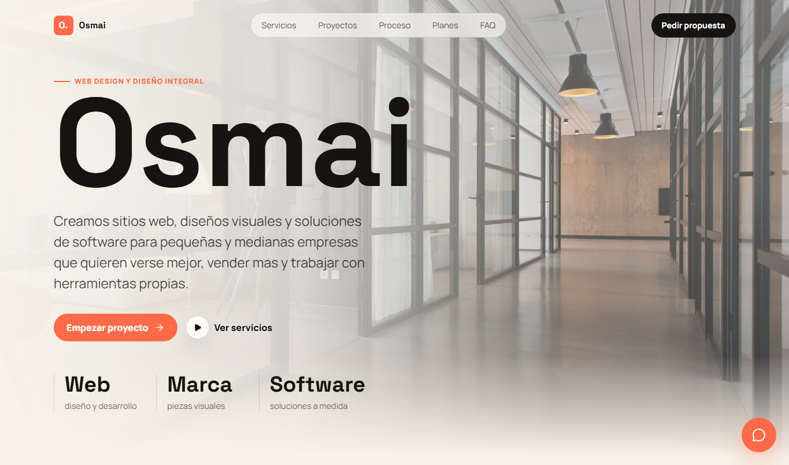
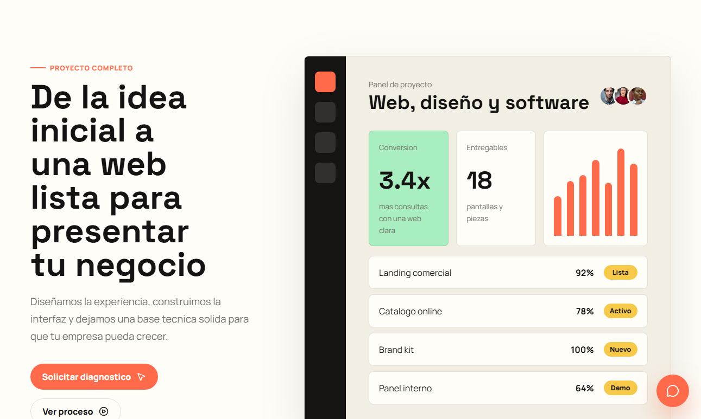
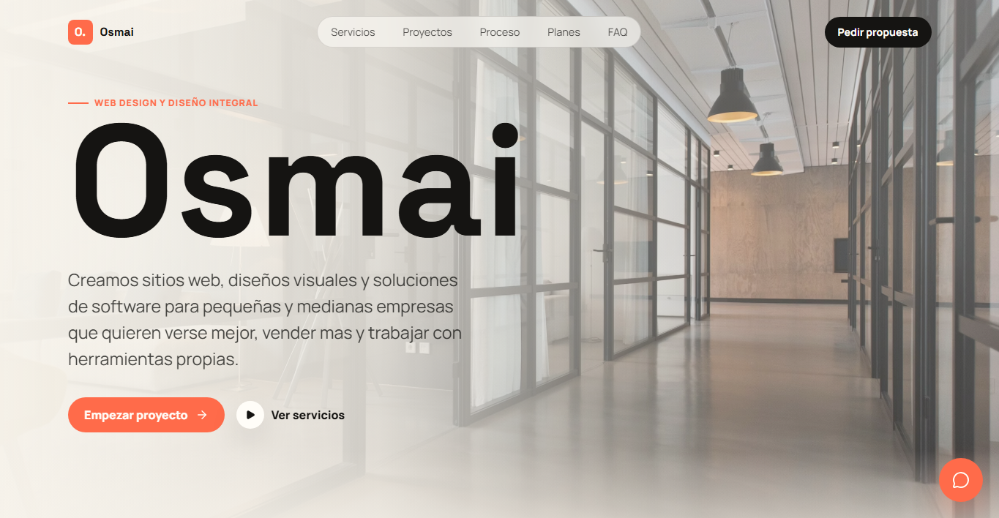

# omcreativos Landing Page

Landing page desarrollada con **Next.js 16** para **omcreativos**, una propuesta de web design, diseño visual y desarrollo de software orientada a pequeñas y medianas empresas.


El sitio presenta a omcreativos como un equipo que combina la parte técnica de **Oscar**, creador, programador web y desarrollador de software, con la mirada visual de **Maira**, encargada de diseño, identidad y piezas gráficas.

### Vista previa







## Sitio en producción

`https://www.omcreativos.com`

## Repositorio

`https://github.com/AlhuayOscar/omcreativos-landing-page`

## De qué trata la página

La landing comunica los servicios principales de omcreativos para negocios que necesitan mejorar su presencia digital, verse más profesionales y trabajar con herramientas propias.

Servicios destacados:

- Diseño web para landing pages, sitios institucionales y páginas comerciales.
- Diseño visual para marcas, redes, piezas gráficas, paletas y sistemas visuales.
- Desarrollo de software para paneles, catálogos, formularios, integraciones y herramientas internas.
- Acompañamiento para pequeñas y medianas empresas que necesitan una solución clara, moderna y escalable.

## Secciones incluidas

- **Hero principal:** presentación de omcreativos con propuesta de valor, navegación y CTA.
- **Servicios:** bloques de diseño web, identidad visual, UX/contenido y soporte cercano.
- **Proyecto completo:** panel visual que muestra métricas, entregables y estado de proyecto.
- **Ideas que venden:** tarjetas editoriales para reforzar el valor de una presencia digital profesional.
- **Beneficios:** ventajas pensadas para pymes, como presencia rápida, escalabilidad y trabajo prolijo.
- **Servicios visuales:** cards para web, branding y software a medida.
- **Rubros:** grilla con tipos de negocios a los que puede servir omcreativos.
- **Proceso:** tabla con etapas de trabajo, tiempos, entregables y responsables.
- **Equipo:** presentación de Oscar y Maira como dupla técnica y creativa.
- **Planes:** tres puntos de partida: Landing, Web Pro y Software.
- **FAQ:** preguntas frecuentes sobre servicios, tiempos, diseño, desarrollo y contacto.
- **Footer:** cierre comercial con CTA final y enlaces internos.

## Funcionalidades

- Animaciones al hacer scroll hacia abajo y hacia arriba.
- Chatbot de prueba fijo en el lateral derecho.
- Respuestas automáticas sobre servicios, Oscar, Maira, planes, tiempos y contacto.
- Botón de WhatsApp para contactar con el equipo cuando el chatbot no pueda responder.
- Diseño responsive para desktop y mobile.
- Capturas de ejemplo incluidas en el README.

## Contacto del chatbot

El botón **Contactar con equipo** abre WhatsApp con el número:

`+54 3487 477269`

## Stack

- Next.js 16
- React 19
- Lucide React
- CSS personalizado
- Vercel

## Estructura principal

```bash
app/
  components/
    Chatbot.jsx
    ScrollAnimator.jsx
  globals.css
  layout.jsx
  page.jsx
docs/
  screenshots/
    hero.png
    project-panel.png
    footer.png
```

## Comandos

```bash
npm install
npm run dev
npm run build
npm run start
npm run test:e2e
npm run test:e2e:ui
```

## Pruebas end-to-end

El proyecto incluye pruebas de Playwright en `tests/omcreativos.spec.js`.

Las pruebas validan:

- Render del hero principal y navegación.
- Navegación hacia las secciones de proyectos y planes.
- Apertura de respuestas en FAQ.
- Funcionamiento del chatbot y enlace de WhatsApp.

Para correrlas localmente:

```bash
npm run build
npm run test:e2e
```

Para abrir el modo visual de Playwright:

```bash
npm run test:e2e:ui
```

## CI/CD

El repositorio incluye un workflow en `.github/workflows/ci.yml` que corre en cada `push` y `pull_request` hacia `main`.

El workflow hace:

- Instalacion con `npm ci`.
- Instalacion de navegadores Playwright.
- Build de Next.js.
- Pruebas end-to-end con Playwright.

## Deploy manual en Vercel

1. Importar el repositorio `AlhuayOscar/omcreativos-landing-page` desde Vercel.
2. Seleccionar framework preset `Next.js`.
3. Usar `npm run build` como build command.
4. Dejar el output con la configuración automática de Vercel para Next.js.
